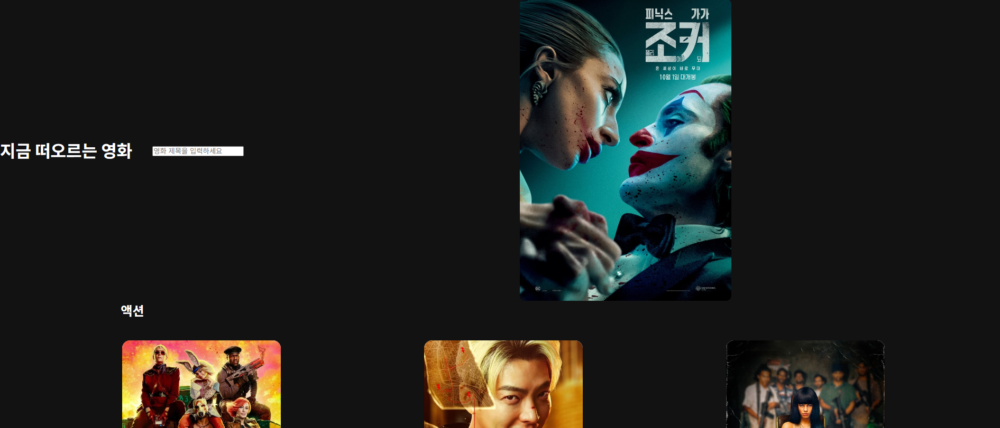
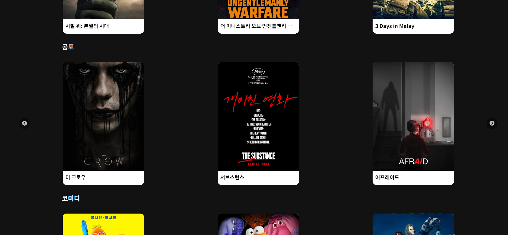
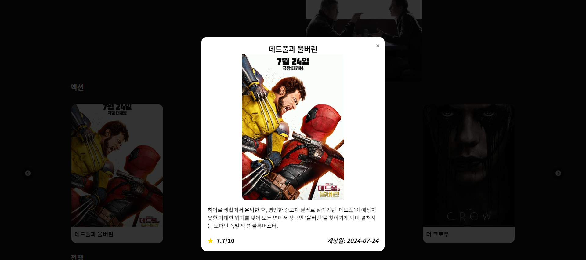
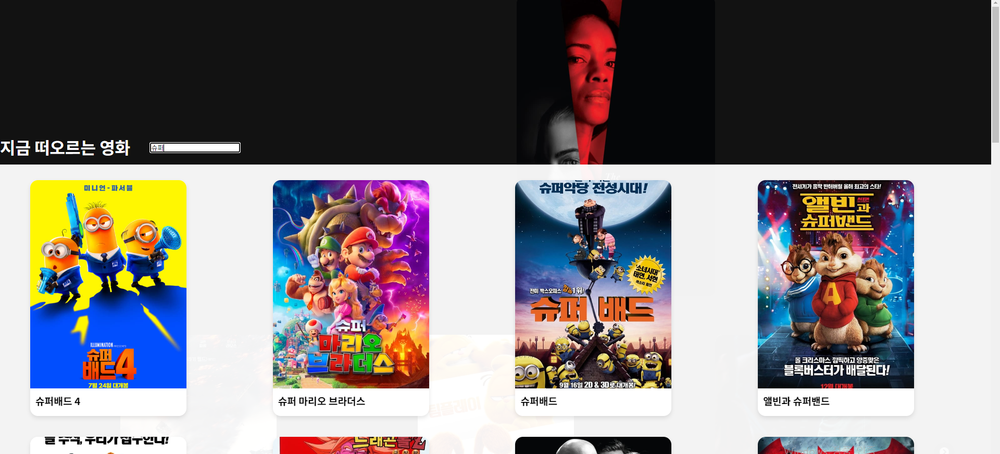

# TMDB API 를 활용환 영화정보, 검색사이트

## 1. 프로젝트 소개

- 배포 URL :https://dabat-tmdb.netlify.app

---

TMDB API 를 활용하여 영화 정보를 소개하는 사이트 입니다.

### 프로젝트 기간

---

2024.09.25 ~ 2024.10.02

### 주요기능

---

- 장르별 영화의 내용을 확인할 수 있다.
- 원하는 영화 내용을 검색할 수 있다.
- 영화 포스터를 클릭하면 영화 줄거리, 평점, 개봉일 등 상세정보를 확인할 수있다.
- 캐러셀 기능 구현을 통해 다양한 영화의 포스터가 자동으로 slide 된다.

### 기술스택

---

#### language

- HTML
- CSS
- JS

---

#### Frontend

- React

### 파일 구조

---

```
📦src
┣ 📂assets
┃ ┗ 📜react.svg
┣ 📂components
┃ ┣ 📂Carousel
┃ ┃ ┗ 📜Carousel.jsx
┃ ┣ 📂Header
┃ ┃ ┣ 📂Search
┃ ┃ ┃ ┣ 📜Search.css
┃ ┃ ┃ ┗ 📜Search.jsx
┃ ┃ ┣ 📂TrendMovie
┃ ┃ ┃ ┗ 📜TrendMovie.jsx
┃ ┃ ┣ 📜Header.css
┃ ┃ ┗ 📜Header.jsx
┃ ┣ 📂Main
┃ ┃ ┣ 📂GenreMovieSlider
┃ ┃ ┃ ┣ 📜GenreMovieSlider.css
┃ ┃ ┃ ┗ 📜GenreMovieSlider.jsx
┃ ┃ ┣ 📂MovieCard
┃ ┃ ┃ ┣ 📜MovieCard.css
┃ ┃ ┃ ┗ 📜MovieCard.jsx
┃ ┃ ┣ 📜Main.css
┃ ┃ ┗ 📜Main.jsx
┃ ┗ 📂Modal
┃ ┃ ┣ 📜Modal.css
┃ ┃ ┗ 📜Modal.jsx
┣ 📂function
┃ ┣ 📜useMoviefetch.js
┃ ┗ 📜useTrendMoviefetch.js
┣ 📜App.css
┣ 📜App.jsx
┗ 📜main.jsx
```

## 2. 프로젝트 정보

#### 기능 소개

---

##### [메인 화면]


"지금 떠오르는 영화 "  
 에는 trend 에 맞는 영화가 자동으로 fade in, fade out 되며 소개된다.

---


홈페이지 메인 화면에는 장르별로 영화가 소개되고, 캐러셀 구현을 통해 장르별 20개의 영화가 시간이 지남에 따라 자동으로 slide 된다.

---


영화 포스터 클릭 시, 영화의 상세 정보를 나타내는 모달창이 나온다.

---

##### [검색]


검색창에 특정 단어를 검색 했을 시 , 특정 단어를 포함하는 영화를 모달창 형식으로 띄운다.

#### 상태관리

---

## 3. 향후 개선방안

---

- 검색기능 구현은 되었으나 css 수정이 필요함.
- 현재 검색시 모달창을 띄우는 형식인데, Context 를 사용해서 여러 페이지 관리하는 형식으로 페이지 수정이 가능해 보임.
- 컴포넌트 관리 미흡. 컴포넌트 관리가 필요함.
